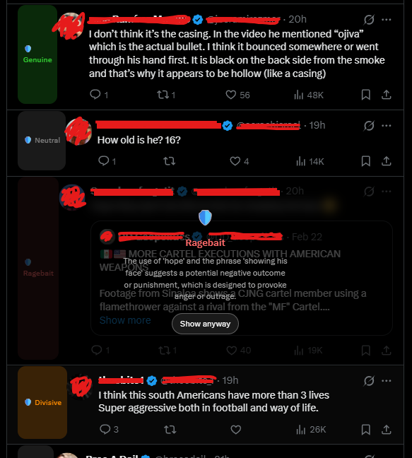

<p align="center">
  
</p>

<h1 align="center">IntentKeeper</h1>

<p align="center"><strong>A digital bodyguard for your mind.</strong></p>

<p align="center">
  <a href="LICENSE"></a>
  
  
  
</p>

IntentKeeper is a local-first content filter that classifies online content by its underlying intent - ragebait, fearmongering, hype, or genuine insight. It sits between you and your feed, surfacing manipulation before it affects you.

---

## The Problem

Every major platform optimizes for engagement. Engagement is driven by emotion. The strongest emotions - outrage, fear, tribal identity - are the easiest to manufacture.

The result: your feed is optimized to make you angry, afraid, and divided. Not because the platform is evil, but because that's what the algorithm rewards.

IntentKeeper doesn't fix the platforms. It gives you a lens to see the manipulation before it hooks you.

## The Idea

> "The content isn't the problem. The intent behind it is."

<p align="center">
  
</p>

A post about politics can be thoughtful analysis or manufactured outrage. A health tip can be genuine advice or fearmongering. Same topic, opposite effect on your wellbeing.

IntentKeeper classifies the **energy** behind the words - not the words themselves. It doesn't censor topics. It surfaces manipulation.

## Quick Start

```bash
# 1. Clone and install
git clone https://github.com/Olawoyin007/intentKeeper.git
cd intentKeeper
pip install -e ".[dev]"

# 2. Pull the model and start the server
ollama pull mistral:7b-instruct
intentkeeper-server

# 3. Load the Chrome extension
# Chrome > chrome://extensions > Developer mode > Load unpacked > select extension/
```

Then open [twitter.com](https://twitter.com) or [x.com](https://x.com) and scroll your feed. You'll see intent labels on every tweet.

See [docs/usage.md](docs/usage.md) for the full setup guide and troubleshooting.

## What It Detects

| Intent | What It Looks Like | What Happens |
|--------|-------------------|--------------|
| **Ragebait** | "This is EXACTLY why I hate [group]. Every. Single. Time." | Blurred with reveal button |
| **Fearmongering** | "Society is COLLAPSING. Get out while you still can." | Tagged with label |
| **Hype** | "This AI tool changes EVERYTHING. You're missing out!" | Tagged with label |
| **Engagement bait** | "Reply with your favorite X and I'll tell you Y!" | Hidden (expandable) |
| **Divisive** | "People who don't do X are just lazy. Winners have discipline." | Tagged with label |
| **Genuine** | "I've dealt with anxiety for 10 years. Here's what helped me." | Tagged (passes through) |
| **Neutral** | "The new transit line opens March 15. Here's the schedule." | Tagged (passes through) |

## How It Works

```
You open Twitter/X
        │
        ▼
Extension intercepts content before you read it
        │
        ▼
Local LLM classifies the intent (via Ollama)
        │
        ▼
Content is blurred, tagged, hidden, or passed through
        │
        ▼
You decide what to engage with
```

All processing happens on your machine. No cloud. No data collection. No tracking.

## Principles

**Intent over topic.** We classify the framing, not the subject matter.

**Fail-open.** When classification fails, content passes through unchanged.

**Local-first.** All classification on your device. Nothing leaves your machine.

**User sovereignty.** You control what gets filtered and how aggressively.

**Transparency.** Every classification shows *why* content was flagged.

See [MANIFESTO.md](MANIFESTO.md) for the full principles.

## Documentation

- [docs/usage.md](docs/usage.md) - Setup guide and troubleshooting
- [docs/architecture.md](docs/architecture.md) - System diagrams
- [ROADMAP.md](ROADMAP.md) - Phased implementation plan
- [CHANGELOG.md](CHANGELOG.md) - Release history
- [CONTRIBUTING.md](CONTRIBUTING.md) - How to contribute
- [MANIFESTO.md](MANIFESTO.md) - Core principles

Also built alongside [empathySync](https://github.com/Olawoyin007/empathySync) - a local-first AI wellness assistant sharing the same philosophy.

## License

MIT - see [LICENSE](LICENSE).

---

*"Protect your attention. Question the energy, not the topic."*
